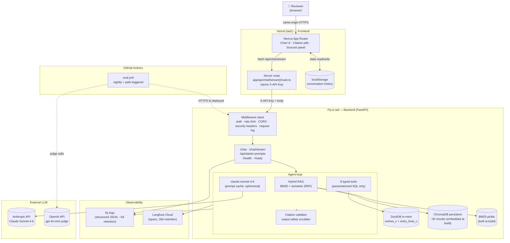

# Architecture

System architecture for the Customs Analytics Agent. Load this file when
the session task touches multiple layers, when wiring together components,
when authoring the architecture diagram for the README, or when explaining
the agent's data flow.

For per-layer detail, see the dedicated context files (`02-data-layer.md`
through `11-deliverables.md`).

---

## One-Paragraph Overview

A conversational agent answers customs-domain questions by routing each
user message through a **hybrid agent pattern** (Fork 2): RAG retrieves
business rules from a small static knowledge base; the LLM picks among
**8 typed tools** that execute deterministic SQL against a DuckDB-loaded
view layer; the backend assembles a **structured sidecar** with citations,
tool calls, and assumptions; the frontend renders prose with inline
citation pills and a collapsible "Sources & Computation" panel. The
backend is FastAPI on Fly.io (`iad` region); the frontend is Next.js App
Router on Vercel (`iad1`). All browser→backend traffic flows through a
Next.js server-side proxy that injects an `X-API-Key` header so the
browser never holds the backend secret.

---

## System Diagram

---

## Layering (Top to Bottom)

Each layer has a single responsibility and a single owning context file.

| Layer | Responsibility | Owning context file |
|---|---|---|
| **Frontend (UI)** | Chat rendering, empty state, citation display, "Sources & Computation" panel, localStorage, streaming consumer, error handling | `06-frontend.md` |
| **Frontend (Server route)** | `X-API-Key` injection, SSE proxying from Fly to browser, environment isolation for the backend secret | `06-frontend.md` + `09-security.md` |
| **API (Middleware)** | Authentication, rate limiting, CORS, security headers, request logging | `05-api-and-backend.md` + `09-security.md` |
| **API (Routes)** | `/chat`, `/chat/stream`, `/api/starter-prompts`, `/health`, `/ready` | `05-api-and-backend.md` |
| **Agent loop** | Tool-calling loop with iteration cap + dedup + budget guard; refusal routing; citation marker validation; output safety; sidecar assembly | `04-agent-and-tools.md` |
| **Tool layer** | 8 typed tools (6 specialized + 1 builder + 1 RAG lookup) executing parameterized SQL against views or returning retrieved chunks | `04-agent-and-tools.md` |
| **RAG layer** | Section-header chunking, hybrid BM25 + semantic retrieval (RRF), always-on context assembly | `03-rag-layer.md` |
| **Data layer** | DuckDB load with typed CAST, materialized views (`entries_v` / `entry_lines_v`), shell-entry flag, ground-truth fixture | `02-data-layer.md` |
| **Infrastructure** | Monorepo structure, Dockerfile, Fly + Vercel deploys, secrets routing, Makefile, setup script | `07-infrastructure.md` |
| **CI/CD + Testing** | GitHub Actions workflows, 3-layer test pyramid, eval grading, PR + rebase-merge flow | `08-cicd-and-testing.md` |
| **Security** | 8-control inventory (2 primary + 6 defense-in-depth), threat model | `09-security.md` |
| **Observability** | structlog stdout JSON, Langfuse traces, log schema, retention, cost tracking | `10-observability.md` |
| **Deliverables** | README, EVALUATION.md, recruiter-topic mappings, future-work organization | `11-deliverables.md` |

---

## Request Lifecycle (POST `/chat/stream`, the canonical path)

Trace a single Tier 3 question (Q9: "Generate a QBR for SAG covering Q1 2025") through the full stack:

1. **Browser** — User types question and presses Enter in the chat input. React state appends the user message. `lib/api.ts` issues `fetch('/api/chat/stream', { method: 'POST', body: { messages: [...], conversation_id } })` to its own origin (no CORS).
2. **Vercel server route (`app/api/chat/stream/route.ts`)** — Reads `process.env.BACKEND_URL` and `process.env.BACKEND_API_KEY` (server-side only; never bundled to client). Forwards the request to `https://customs-agent-backend.fly.dev/chat/stream` with `X-API-Key` header attached.
3. **Fly backend middleware chain** (in order):
   1. `SecurityHeadersMiddleware` adds `X-Content-Type-Options`, `X-Frame-Options`, `Referrer-Policy`, `Strict-Transport-Security` to the response (Fork 51).
   2. `CORSMiddleware` checks origin against the env-var allowlist (Fork 38). For server-to-server calls from Vercel there's no Origin header, so this is a no-op; it's defense-in-depth.
   3. `request_logging_middleware` generates a `request_id` UUID, binds it to a contextvar, and emits `event: request.received` to stdout with `path`, `method`, `client_ip`, `api_key_prefix` (first 8 chars).
   4. `SlowAPIMiddleware` checks the composite rate limit bucket `(api_key_prefix, client_ip)` — 20/min on `/chat/stream` (Fork 47). If exceeded, returns 429 with `Retry-After`.
   5. `require_api_key` dependency on the endpoint validates `X-API-Key` via `secrets.compare_digest` against `BACKEND_API_KEY` from Fly Secrets (Fork 48). Missing → 401; invalid → 403.
4. **`/chat/stream` endpoint handler** — Parses the `ChatRequest` (with Pydantic, including `max_length=2000` on user message content per Fork 49 layer 1). Constructs a `StreamingResponse` with an SSE `event_generator()`.
5. **Agent loop** (`agent/loop.py`) — Wraps the SSE generator:
   1. **RAG retrieval** (`rag/retriever.py`): hybrid BM25 + semantic over the user's message with RRF fusion (Fork 16); returns top-5 chunks. Emits `event: knowledge_retrieved` with chunk IDs (Fork 29 Phase 2).
   2. **Assemble Anthropic request**: system message = templated stable prefix (persona + scope + data overview + always-on knowledge + behavioral rules + tool guidance + output format) with `cache_control: ephemeral` marker (Fork 55). User message contains retrieved chunks + the user's actual question. Tool definitions (8 tools) passed via `tools=` parameter.
   3. **First LLM call**: streamed via Anthropic Messages API. Tool-use block emitted (`qbr_summary({"customer_code": "SAG", "period": "2025-Q1"})`).
   4. **Tool execution** (`tools/qbr_summary.py`): emits `event: tool_call_started`. Pydantic validates args (Forks 21, 50). Calls `safe_execute(con, sql, params)` against `entries_v` and `entry_lines_v` for the 4 QBR sub-sections (volume by month, duty breakdown, top countries, hold rate). Returns `ToolResult` envelope with data + meta (including `sql_executed` + `view_used` + `shell_entries_excluded`). Emits `event: tool_call_completed`.
   5. **Second LLM call**: tool result fed back into Anthropic. Final assistant message streams as `event: token` deltas.
   6. **Output validation** (`agent/validator.py`): citation marker validator strips any orphan `[N]` (Fork 28). Output safety scrubber checks for prohibited patterns (Fork 49 layer 5).
   7. **Sidecar assembly**: `knowledge_citations[]` built from retrieved chunks the agent cited; `tool_calls[]` built from real tool execution history; `assumptions[]` extracted from explicit assumption notes (Fork 24); `meta` populated with `request_id`, `prompt_version`, `model`, `temperature`, `iterations_used`, token counts (incl. `cache_read_input_tokens`), `estimated_cost_usd` (G11), `langfuse_trace_url`.
   8. **`event: complete`** with the full `ChatResponse` payload.
6. **Observability spans** (Langfuse, Fork 52) accumulate throughout the agent loop: `chat` trace with nested `rag.retrieve`, `llm.call` (×2), `tool.qbr_summary`, `output.validation` spans. Each span carries inputs, outputs, latency, tokens, cost (Fork 11/G11). Trace flushed asynchronously after the response.
7. **Stdout JSON log** — `event: request.completed` emitted with `status: 200`, `latency_ms`, `iterations_used`, `tools_called`, `langfuse_trace_url` for cross-store pivot.
8. **Vercel server route** forwards the SSE stream back to the browser unchanged.
9. **Browser** — `lib/sse.ts` parses each event; `<Chat>` appends streaming tokens to the assistant message bubble; `<AgentPanel>` populates the "Sources & Computation" panel progressively as `knowledge_retrieved` and `tool_call_*` events arrive (Fork 31). Final `complete` event reconciles the in-progress state with the canonical sidecar and writes to localStorage (Fork 7).

For Q1-style direct-retrieval questions, the path is the same but typically terminates in a single tool call (e.g., `query_entries`) and a single LLM call after it, with much lower latency.

---

## Single-Source-of-Truth Contracts

Every cross-layer contract has exactly one authoritative file. Drift between
layers is prevented by either Pydantic validation, generated TypeScript, or
CI-checked invariants.

| Contract | Authoritative source | How drift is prevented |
|---|---|---|
| **Pydantic `ChatRequest` / `ChatResponse` shapes** (Fork 28) | `backend/src/customs_agent/api/chat.py` | OpenAPI export → `openapi.json` → `openapi-typescript` generates `frontend/src/lib/api-types.ts`; `api-contract` CI job diffs both files (G3) |
| **`EntryFilters` (typed Pydantic with `Literal` enums)** (Fork 21) | `backend/src/customs_agent/tools/_filters.py` | Boot-time validator asserts DB enum values match the `Literal` (Fork 18 validation) |
| **`PROMPT_VERSION` string** (Fork 27) | `backend/src/customs_agent/agent/prompt.py` | Snapshot test catches accidental changes in PRs; advisory `evaluation-freshness` CI check warns when EVALUATION.md version drifts (G5) |
| **Tool inventory (8 tools)** (Fork 22) | `backend/src/customs_agent/tools/__init__.py` | Integration tests verify each tool is wired into the agent loop (Fork 45 Layer 2) |
| **Dataset SHA-256** (Fork 43) | `backend/tests/ground_truth.json` `dataset_sha256` field | Eval-suite session fixture computes live SHA and fails fast on drift |
| **Knowledge corpus** (Fork 14) | `backend/knowledge/*.txt` | Build-time `scripts/build_index.py` reads these files; manifest records source file SHAs |
| **Citation chunk IDs** (Fork 12, 28) | RAG retriever returns real chunks with stable IDs; tool calls record their own metadata | Backend assembles `knowledge_citations[]` + `tool_calls[]` from real history (LLM never authors them); orphan `[N]` markers in prose are stripped (Fork 28) |
| **Pricing constants** (G11) | `backend/src/customs_agent/observability/pricing.py` (date-stamped) | Manual quarterly verification against Anthropic / OpenAI pricing pages |
| **Starter prompts** (Fork 30) | `backend/config/starter_prompts.py` (also feeds Fork 25 refusal suggestions) | Single import in `/api/starter-prompts` endpoint + refusal handler |
| **CORS allowlist** (Fork 38) | `ALLOWED_ORIGINS` env var (Fly Secret); same value documented in `.env.example` | Verified manually on first deploy; documented regex matches Vercel preview URL pattern |

---

## Cross-Cutting Concerns

Threads that touch every layer.

### `request_id` propagation

- Generated by `request_logging_middleware` on every request as a UUID string (`req_<12 hex chars>`)
- Bound to a `ContextVar` so `structlog` automatically includes it in every log line within the request
- Attached to the Langfuse trace as `metadata.request_id`
- Returned to the frontend in `ChatResponse.meta.request_id`
- The `event: request.completed` stdout line carries `langfuse_trace_url` so log → trace pivot is one click

### Error propagation

| Error origin | Surfaces as | Handled by |
|---|---|---|
| Pydantic validation (e.g., `max_length=2000` exceeded) | HTTP 422 with Pydantic detail | FastAPI default |
| Missing/invalid `X-API-Key` | HTTP 401 / 403 with structured `{error, message}` body | `require_api_key` dependency (Fork 48) |
| Rate limit exceeded | HTTP 429 with `Retry-After` header + `{error: "rate_limited", retry_after: N}` | `slowapi` exception handler (Fork 47) |
| Tool args validation failure (e.g., invalid `group_by`) | Tool returns error to agent loop; loop logs and bails out gracefully | Pydantic validators in `QueryEntriesArgs` (Fork 50) |
| Agent iteration cap hit | Final `ChatResponse` with `meta.iteration_limit_hit: true` + partial answer | Agent loop graceful degradation (Fork 23) |
| Output safety pattern matched | Full response redacted + `meta.output_safety_redacted: true` | `agent/output_safety.py` (Fork 49 layer 5) |
| Out-of-scope user message | `ChatResponse` with `refused: true` + `refusal_category` | Agent loop refusal routing (Fork 25) |
| LLM provider 5xx / timeout | Agent loop catches; emits `event: error` SSE; returns degraded response | Try/except in agent loop |

Frontend maps each shape to a toast variant via the unified `ApiError` table (G10).

### Observability touchpoints

Every layer emits to at least one of the two sinks:

| Layer | stdout (structlog JSON) | Langfuse |
|---|---|---|
| Middleware | request.received, request.completed, request.failed, ratelimit.hit, auth.invalid_key, cors.preflight_rejected | — |
| API endpoint | (relies on middleware) | trace start (`@observe`) |
| Agent loop | agent.refusal, agent.iteration_limit, agent.duplicate_tool_call, agent.trace_created | trace + nested spans |
| RAG retrieval | — | `rag.retrieve` span with chunk IDs + scores |
| Tool execution | sql_safety.invalid_column_name (on error only) | `tool.<name>` span with args + result + sql_executed |
| Output validation | output_safety.redaction (on hit only) | `output.validation` span |
| LLM call | (only on failure) | `llm.call` span with tokens, cache hit, cost |

See `10-observability.md` for the full event taxonomy.

---

## Architectural Principles (the "why" behind the structure)

These five principles drive most of the implementation decisions. When in
doubt during build, ask: "Does this choice uphold these principles?"

1. **Rules in code, not in prose.** Tools encode business rules (MPF cap, Section 301 NULL handling, hold-rate benchmark, KB date-filter default). The LLM picks tools but never computes facts directly. This makes accuracy testable, deterministic, and auditable. Translates Fork 2 + Fork 22 + Fork 50 into a single guiding principle.
2. **LLM owns narrative; backend owns facts.** Sidecar split authorship (Fork 28): LLM writes prose with `[N]` citation markers; backend constructs the citation list from real retrieval history and real tool calls. Hallucinated citations become structurally impossible.
3. **Fail-secure by typing.** Pydantic `Literal` enums (Fork 21) + parameterized SQL (Fork 22) + column-name allowlists (Fork 50) make invalid tool calls schema-reject at the boundary, not a runtime error in SQL. Combined with Forks 49 (prompt injection) and 51 (security headers), the system has no realistic SQL or injection vector.
4. **Deterministic where possible, defensive where not.** Temperature 0 (Fork 26) + seed on OpenAI judge minimizes LLM variance; structured sidecar assertions (Fork 8) test the deterministic outputs rather than fragile prose; numeric tolerances absorb the residual non-determinism (Fork 43, 46).
5. **Observable by default.** Every request gets a trace; every span carries tokens + cost + latency; every error has a structured event in stdout; the same `request_id` joins both stores. Debugging Tier 3/4 failures is one click in Langfuse rather than print-statement archaeology (Fork 10, 52).

---

## Where to Find What (file-to-decision map)

When working on a specific concern, load only the matching context file(s).
Frequent cross-references are by name, not duplication.

| If you're working on... | Load these context files |
|---|---|
| The data layer (load, views, validators) | `02-data-layer.md` |
| RAG (chunking, retriever, always-on) | `03-rag-layer.md` |
| Tools, agent loop, refusal, sidecar, system prompt | `04-agent-and-tools.md` |
| FastAPI app, endpoints, middleware, health | `05-api-and-backend.md` |
| The chat UI, citation rendering, streaming consumer | `06-frontend.md` |
| Docker, Fly, Vercel, secrets, Makefile, setup | `07-infrastructure.md` |
| CI workflows, tests, eval grading, PR flow | `08-cicd-and-testing.md` |
| Security controls, threat model | `09-security.md` |
| Logging, Langfuse, retention, cost tracking | `10-observability.md` |
| README structure, EVALUATION.md, future-work organization | `11-deliverables.md` |
| Multi-layer wiring task | This file (`01-architecture.md`) + targeted layer files |
| "What did we decide about X?" | `00-decisions-index.md` |

---

## Two Diagrams Worth Drawing for the README

For Day 7's README architecture section (per Fork 57 item #36):

1. **The system diagram** above (Mermaid), simplified to fit the README's width.
2. **The agent loop flow** as a sequence diagram, showing one Tier 3 question moving through retrieval → first LLM call → tool execution → second LLM call → sidecar assembly → streamed response. This is the single most compelling "show your work" visual for reviewers.

Don't over-diagram. Two diagrams in the README is plenty; more becomes noise.
